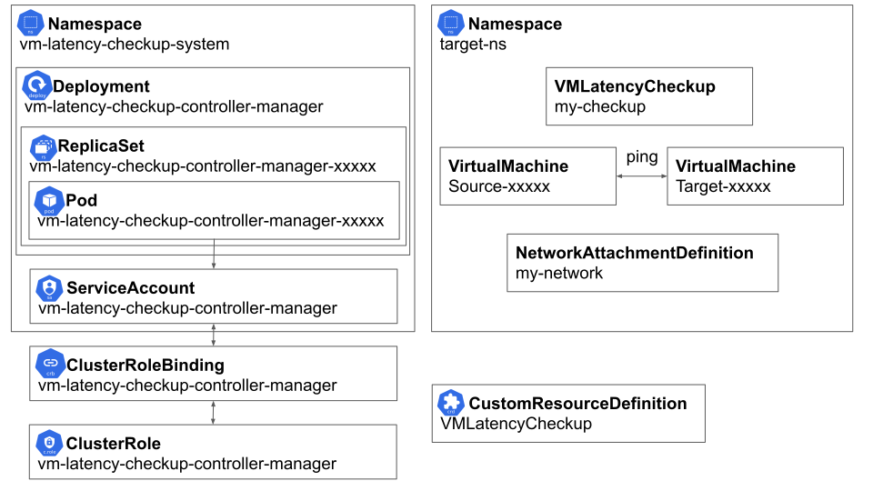

VM Latency Checkup Operator
=

Author: [Orel Misan](https://github.com/orelmisan)

# Summary

This document proposes a conversion of
the [VM latency checkup](https://github.com/kiagnose/kiagnose/tree/main/checkups/kubevirt-vm-latency) into
a [Kubernetes](https://kubernetes.io/) [operator](https://kubernetes.io/docs/concepts/extend-kubernetes/operator/).

The principals depicted in this document could be applied to other checkups as well.

# Motivation

Currently, the deployment, configuration and execution of the VM latency checkup are cumbersome, requiring cluster-admin
permissions and error-prune.

The common way of creating a native Kubernetes application is by using the operator pattern -
a [custom controller](https://kubernetes.io/docs/concepts/extend-kubernetes/api-extension/custom-resources/#custom-controllers)
reconciling [CustomResource](https://kubernetes.io/docs/concepts/extend-kubernetes/api-extension/custom-resources/)
objects.

Advantages:

1. The operator is easy and convenient to deploy and use.
2. An operator enables the usage of regular K8s RBAC rules to enable fine-grained control over which users could execute a specific checkup type.
3. The user’s spec input is validated (before storing it to etcd) according to the CustomResourceDefinition scheme, and
   additional logic could be implemented using an admission webhook.
4. Using a reconciliation loop enables overcoming momentary cluster errors, such as connectivity errors.
5. The business logic is centralized and contained in its own namespace.
6. The powerful [ServiceAccount](https://kubernetes.io/docs/tasks/configure-pod-container/configure-service-account/)
   object used by the checkup is located in a single central location, inaccessible to regular users - thus increasing
   security.
7. Addition / removal / update of checkup permissions are done in a single place, compared to the existing solution which spreads checkup permissions in every namespace it is used at.
8. The checkup image is not set by the user - thus increasing security. 

This proposal shall leverage the power of the [Operator Lifecycle Manager](https://olm.operatorframework.io/) (OLM) in
order to manage the checkup’s life cycle:

1. Deployment and removal.
2. Upgrade.
3. Declare a dependency on the [Kubevirt](https://kubevirt.io/) operator.

Disadvantages:
1. Checkup authors need to familiarize themselves with writing and maintaining an operator.
2. The API between checkup kinds is not uniform.
3. There is a custom controller running at all time, though it shall be seldom used as a diagnostic tool.

## Goals

1. Convert the VM latency checkup to an operator and keep its functionality.
2. Provide a reference implementation of a checkup as an operator.
3. Do not disrupt or interfere with existing cluster workloads. This includes making sure no leftovers exist on
   termination.

## Non Goals

1. GUI is not in the scope of this document.
2. Deploying components the checkup requires.

# Proposal

## Definition of Personas

1. Cluster administrator.
2. Namespace administrator.

## User Stories

As a Cluster administrator:

1. I want to be able to deploy the VM latency checkup operator using OLM, in order to use it.
2. I want to use standard K8s RBAC rules in order to grant users the permissions to execute the VM latency checkup.
3. I want to be able to examine the checkup’s execution, in order to be able to debug problems or understand what was
   actually done on success.

As a Namespace administrator:

1. I want to be able to execute a checkup instance by creating a CR in my namespace, in order to measure the latency of
   two VMs using a shared NetworkAttachmentDefinition.
2. I want to be able to monitor the checkup’s progression.
3. I want to be able to fetch the checkup results.

## API

### User Interface

The checkup’s API shall be based on a namespaced CustomResourceDefinition.

#### Spec

| Field Name                           | Description                                              | Type   | Units | Optional | Remarks                                                                              |
|--------------------------------------|----------------------------------------------------------|--------|-------|----------|--------------------------------------------------------------------------------------|
| networkAttachmentDefinitionNamespace | Namespace of existing NetworkAttachmentDefinition object | string | N/A   | True     | If this field is empty, the object is assumed to be at the same namespace as the CR. |
| networkAttachmentDefinitionName      | Name of existing NetworkAttachmentDefinition object      | string | N/A   | False    |                                                                                      |
| sourceNode                           | Name of existing node in the cluster                     | string | N/A   | True     | Mandatory if target node is specified                                                |
| targetNode                           | Name of existing node in the cluster                     | string | N/A   | True     | Mandatory if source node is specified                                                |
| sampleDurationSeconds                | How much time should the latency checkup take            | int64  | [sec] | True     |                                                                                      |
| maxDesiredLatencyMilliSeconds        | Latency threshold over which the checkup shall fail      | int64  | [ms]  | True     |                                                                                      |

> **_Note_**: The spec shall be immutable after the creation of the CustomResource.

#### Status

| Field Name                   | Description                                   | Type   | Units  | Optional | Remarks |
|------------------------------|-----------------------------------------------|--------|--------|----------|---------|
| conditions                   |                                               |        |        | False    |         |
| sourceVM                     | Source VM name                                | string | N/A    | True     |         |
| targetVM                     | Target VM name                                | string | N/A    | True     |         |
| sourceNode                   | Node name on which the sourceVM was scheduled | string | N/A    | True     |         |
| targetNode                   | Node name on which the targetVM was scheduled | string | N/A    | True     |         |
| maxLatencyNanoSec            | Maximum measured latency                      | int64  | [nsec] | True     |         |
| avgLatencyNanoSec            | Average measured  latency                     | int64  | [nsec] | True     |         |
| minLatencyNanoSec            | Minimum measured latency                      | int64  | [nsec] | True     |         |
| actualMeasurementDurationSec | Measurement time                              | int64  | [sec]  | True     |         |

### Example Configuration

```yaml
apiVersion: vmlatency.kiagnose.io/v1alpha1
kind: VMLatencyCheckup
metadata:
  name: checkup1
spec:
  networkAttachmentDefinitionName: bridge1network
  sourceNode: worker01
  targetNode: worker02
  sampleDurationSeconds: 5
  maxDesiredLatencyMilliSeconds: 100
```

### Example Results

```yaml
apiVersion: vmlatency.kiagnose.io/v1alpha1
kind: VMLatencyCheckup
metadata:
  name: checkup1
spec:
  networkAttachmentDefinitionName: bridge1network
  sourceNode: worker01
  targetNode: worker02
  sampleDurationSeconds: 5
  maxDesiredLatencyMilliSeconds: 100
status:
  conditions:
  sourceVM: checkup1-hgu4s
  targetVM: checkup1-acj4hv
  sourceNode: worker01
  targetNode: worker02
  maxLatencyNanoSec: 120000000
  avgLatencyNanoSec: 100000000
  minLatencyNanoSec: 80000000
  actualMeasurementDurationSec: 5
```

## Implementation Details/Notes/Constraints

In order to use this checkup, a user should only use the [kubectl](https://kubernetes.io/docs/reference/kubectl/)
utility (or any other programmatic K8s client).

The checkup shall be written using the [operator-sdk](https://sdk.operatorframework.io/) project in
the [Go](https://go.dev/) programming language.

### Component Dependency

The solution assumes the following components are available (and correctly set):

- Kubevirt is deployed and active in the cluster.
- Multus is deployed and ready.
- The NetworkAttachmentDefinition is defined and correctly configured, with a working backend network.

### IP Stack

The checkup shall support single stack IPv4, IPv6 and dual stack clusters.

# Design Details

## Main Components



### Custom Controller

The custom controller shall:

1. Be deployed to a namespace of its own.
2. Watch all namespaces in the cluster for changes to its CustomResource objects.
3. Create and watch its operands in the same namespace as the CustomResource object.

The custom controller is granted API access permissions by using a ServiceAccount bound to a ClusterRole.

### NetworkAttachmentDefinition

Is used to configure the source and target VMs’ secondary network. Created by the user prior to checkup execution.

### CustomResource

Created by the user in the namespace he wishes to execute the checkup, based on the CustomResourceDefinition.
Shall be used to configure and monitor the checkup execution.
Source and Target VirtualMachine Objects
Kubevirt VirtualMachine objects are the operands of the custom controller. Shall be used to test network connectivity
and latency over their secondary network, defined by the NetworkAttachmentDefinition object defined by the user.
Deployed to the namespace on which the CustomResource was defined.

## Main Processes

### Checkup Deployment

The checkup could be deployed in one of two ways:

1. Deployment using OLM.
2. Raw deployment using the kubectl utility.

### Checkup Removal

Depending on the way the checkup was deployed, it could be removed:

1. Using OLM.
2. Using the kubectl utility.

### Checkup Execution

A user shall create a VMLatencyCheckup CustomResource object, filling the object’s spec section with the configuration
for the checkup instance.

The checkup’s controller shall:

1. Watch the VMLatencyCheckup CustomResource objects.
2. Create two VirtualMachine CustomResource objects.
3. Watch for the completion of the latency check.
4. Write the checkup’s results to the VMLatencyCheckup object status section.
5. Delete the previously created VirtualMachine objects.

# Implementation Phases

## Phase 0 - Level 1 Operator

### Required Functionality

1. Ability to deploy the operator using kubectl.
2. Ability to execute at least one checkup instance.
3. CI system with:
    - Linter.
    - Build system for the binary and container image.
    - Unit testing.
    - End-to-end tests.

### Deliverables

1. controller-manager image.
2. Manifest files required to deploy the checkup.
3. Reference Virtual machine images.

## Phase 1 - OLM Integration

### Required Functionality

1. Ability to deploy / remove / update the operator using OLM and OperatorHub.
2. Ability to signal OLM that the operator should not be updated at the moment (if there are executing checkups).

## Phase 2 - Exposing Metrics

### Required Functionality

Ability to expose metrics that could be usable to debug the operator / cluster.

# Open Issues

TBD

# Future Extension

An API between the custom controller and the source/target VMs could be used in order to make the VM image pluggable,
and thus enable users to have their own custom tool for latency measurement.

