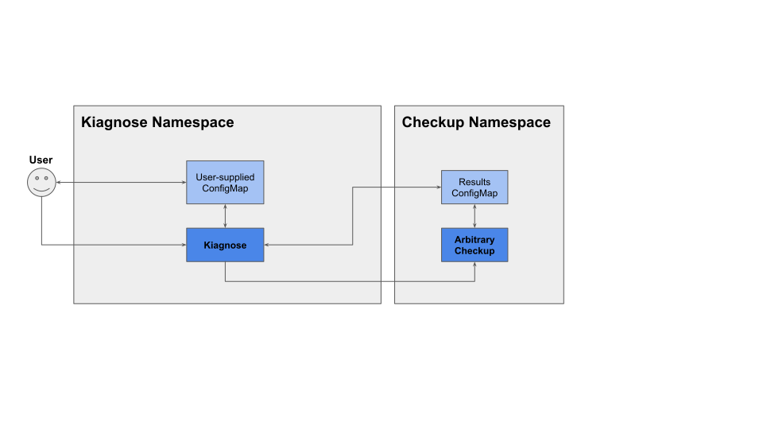

Kiagnose - Kubernetes Checkup Framework
=

**Authors**: [Edward Haas](https://github.com/eddev), [Orel Misan](https://github.com/orelmisan), [Or Mergi](https://github.com/ormergi)

# Summary

This proposal introduces Kiagnose: a framework to verify that certain cluster functionalities are working as expected.

# Motivation

Operating a [K8s](https://kubernetes.io/) cluster is challenging. Such clusters usually provide a wide range of functionalities and services, some
provided by K8s itself, some by downstream distribution of it (e.g. OpenShift) and others by third-party vendors. All
are expected to co-exist and work properly on various deployments (on cloud providers, bare-metal etc).

Clusters that provide multiple functionalities are challenging and time-consuming for their administrators to
troubleshoot. Understanding why a specific functionality is not working as expected requires deep understanding of how
it works, its interaction and dependencies with other parts of the cluster. Considering that each deployment is unique,
it is time-consuming for both the cluster administrator and the vendor of a functionality to troubleshoot unexpected
behavior.

To simplify cluster operation and maintenance, it will be beneficial to allow cluster administrators to validate that
the cluster can support a specific functionality/service and to provide a simple indication that they are working as
intended.

Authors of features and services should be able to easily write and publish predefined checkups that will verify that
their feature / service works as expected on a pre-deployed cluster.

## Goals

- Deploy a checkup to a cluster.
- Run the predefined checkup on a cluster on an existing or on ephemeral Namespace.
- Provide a reference implementation of a checkup.
- Do not disrupt or interfere with existing cluster workloads. This includes making sure no leftovers exist on
  termination.
- Checkup execution should require minimal dependencies, allowing a cluster administrator or some management tool to
  trigger it.
- Deploy and run the checkups on any K8s-based cluster.
- Provide a well-defined API, allowing management components to interact with Kiagnose.

## Non Goals

- Defining content of the checkup, including its correctness, quality and reliability, is up to its author.
- GUI is not in the scope of this document.
- Deploying clusters.
- Deploying components that a specific checkup may require.

# Proposal

## Definition of Personas

- K8s cluster administrators.
- K8s namespace administrators.
- Vendors who provide verification of their K8s extensions.

## User Stories

As a cluster administrator:

- I want to check that my deployed cluster is correctly set up and is capable of working with a specific
  functionality/service.
    - I pick the predefined checkup that checks a feature / service and run it.
    - While it runs, my existing workloads are not affected.
    - I can monitor and observe if the checkup is undergoing or finished.
    - Once the checkup is finished, I can see if it succeeded or failed.
    - I do not need to worry about any leftovers from the run, as I am assured that everything is cleaned up upon
      checkup termination.
    - I can export the checkup results, cluster state and all other relevant information, so I can analyze them or pass
      them on to experts.
- I want to check my deployed cluster with checkups that require my input to operate.
    - I pick the predefined checkup that checks a feature / service and run it.
    - The checkup will fail if I forget to specify an input value (e.g. ref to an existing NetworkAttachmentDefinition, namespace, etc).
    - The checkup will fail if my input is wrong (does not fit with what exists in the cluster).
    - In case the input validation fails, I can observe the status of the checkup as “setup-failed”.
    - In case my input is correct, the checkup should run like in the basic scenario.
    - I can export the checkup results, cluster state and all other relevant information, so I can analyze them or pass
      them on to experts.
- I want to check my deployed cluster with checkups that report additional data, beyond success/failure.
    - I pick the predefined checkup that checks a feature / service and run it.
    - The checkup should run like in the basic scenario.
    - Once the checkup is finished, I can review the additional data, beyond the success/failure.
    - I can export the checkup results, cluster state and all other relevant information, so I can analyze them or pass
      them on to experts.

As a namespace administrator:

- I want to check that the cluster is capable of providing me a specific functionality/service.
    - I pick the predefined checkup that checks a feature / service and run it in my own **existing** namespace.
    - I can monitor and observe if the checkup is undergoing or finished.
    - Once the checkup is finished, I can see if it succeeded or failed.
    - I can export the checkup results, cluster state and all other relevant information, so I can analyze them or pass
      them on to experts.
    - I should check that the Namespace I administrate has no leftovers remaining after the checkup's execution.

As a vendor:

- I want to write a checkup for a feature / service I provide, to validate the cluster that is aimed to use it.
    - I want to have a reference for a checkup, so it can help me write my own.
    - I want to use my technology of choice (e.g language, OS, etc).
    - I am able to run the checkups locally during development.
- I want to publish the checkups to my customers.
- I want to support my customers:
    - I want to ask the customer to run the checkups and collect the results.
    - I want to accept checkup results data from my customers, so I could analyze it.

## Exploration of Similar Projects

Exploring existing solutions revealed several projects which aimed to run various tests on running clusters.

These solutions may be grouped into the following categories:

- Collection of tests that are grouped together under the same project with basic tooling to execute them.
- Collection of tests that are grouped together for certification with tooling that help integrate their run and
result posting to Red Hat ([preflight](https://github.com/redhat-openshift-ecosystem/openshift-preflight)).
- Framework which can run arbitrary workloads ([Sonobuoy](https://sonobuoy.io/)).

The first two groups focus on self curated tests and not on arbitrary ones.
In addition, the two groups are expected to run on dedicated (test) clusters and not on production clusters.
These two points are at the core of our requirement and therefore not good candidates.

The closest solution found is Sonobuoy.
Based on the information gathered so far, its main limitation is the need to use a binary at the client side and the
lack of a proper API (programmatic/declarative) without it.
Wrapping around this solution is an option, however, it brings the cost of maintaining this wrapper and still being
limited by the underlying tool.

A table comparing the similar solutions can be found [here](./similar_projects_comparison.md).


## API Extensions

### User Interface

#### Overview

> **_Note_**: Kiagnose uses well-defined [ConfigMap](#configuration-and-output-specification) and
> [Job](#job-specification) objects (described below).
> 
> This interface could evolve in the future to a 
> [CRD](https://kubernetes.io/docs/concepts/extend-kubernetes/api-extension/custom-resources/) and a dedicated controller.

1. The user shall create a **mutable** ConfigMap object (User-supplied ConfigMap) in the `kiagnose` namespace in order to:

- Provide input for Kiagnose itself.
- Provide input for the selected checkup.
- Receive an output at the end of the checkup run.

> **_Note_**: It shall be the user’s responsibility to remove the user-supplied ConfigMap object after the results are read.

2. The user shall create a Job object in order to run Kiagnose.
3. The user shall wait for the checkup Job to finish and get the checkup results from the user-supplied ConfigMap object.

#### Configuration and Output Specification

```yaml
---
apiVersion: v1
kind: ConfigMap
metadata:
  name: <arbitrary name>
  namespace: kiagnose
data:
  spec.image: <checkup image name>
  spec.timeout: <timeout to wait for checkup to finish [min]>
  spec.param.<checkup environment variable name>: <arbitrary string value>
  spec.param.<another checkup environment variable name>: <arbitrary string value>
  spec.clusterRoles: |
    <name of existing clusterRole>
    <name of another existing clusterRole>

  spec.roles: |
    <namespace/role name>
    <namespace/role name>
  …
  status.succeeded: <true|false>
  status.failureReason: <empty string|reason>
  status.startTimestamp: <timestamp when the checkup was started>
  status.completionTimestamp: <timestamp when the checkup was finished or timed-out>
  status.result.<result property name>: <arbitrary result string>
  status.result.<another result property name>: <arbitrary result string>
…
```

##### Configuration Fields

| Key                                  | Description                                                                              | Is Mandatory | Remarks                                                                      |
|--------------------------------------|------------------------------------------------------------------------------------------|--------------|------------------------------------------------------------------------------|
| `spec.image`                         | Checkup image                                                                            | True         |                                                                              |
| `spec.timeout`                       | Timeout to wait for a checkup to finish [min]                                            | True         |                                                                              |
| `spec.param.<checkup argument name>` | Arbitrary parameter required by the concrete checkup                                     | False        | 0..N                                                                         |
| `spec.clusterRoles`                  | ClusterRole required by the checkup Value format: `<ClusterRole name>` Newline separated | False        | 0..N e.g: `default/nad-reader` Should already exist before launching the Job |
| `spec.roles`                         | Role required by the checkup Value format: `<namespace/name>` Newline separated          | False        | 0..N e.g: `default/nad-reader` Should already exist before launching the Job |

##### Output Fields

The user shall expect the checkup results concatenated to the user-supplied ConfigMap object at the end of the checkup run.
The output shall contain the following fields, plus the concrete checkup own results:

| Key                                    | Description                                | Is Mandatory | Remarks                                         |
|----------------------------------------|--------------------------------------------|--------------|-------------------------------------------------|
| `status.succeeded`                     | Is the checkup successful                  | True         | true/false                                      | 
| `status.failureReason`                 | Checkup failure reason                     | True         | `<empty string/input/setup/check>: <free text>` |
| `status.startTimestamp`                | Timestamp of when the checkup was started  | True         | ISO 8601                                        |
| `status.completionTimestamp`           | Timestamp of when the checkup was finished | True         | ISO 8601                                        |
| `status.result.<result property name>` | Arbitrary string reported by the checkup   | False        | 0..N                                            |

#### Job Specification
The user shall specify the name of the previously created user-supplied ConfigMap as an environment variable:

```yaml
---
apiVersion: batch/v1
kind: Job
metadata:
  name: kiagnose-job-
  namespace: kiagnose
spec:
  backoffLimit: 0
  template:
    spec:
      serviceAccount: kiagnose
      restartPolicy: Never
      containers:
        - name: framework
          image: quay.io/kiagnose/kiagnose:<release tag>
          imagePullPolicy: Always
          env:
            - name: CONFIGMAP_NAMESPACE
              value: <ConfigMap namespace>
            - name: CONFIGMAP_NAME
              value: <ConfigMap name>
...
```

#### Checkup Execution Example
##### Input
```yaml
---
apiVersion: v1
kind: ConfigMap
metadata:
  name: echo-checkup-config
  namespace: kiagnose
data:
  spec.image: quay.io/kiagnose/echo-checkup:main
  spec.timeout: 1m
  spec.param.message: "Hi!"
---
apiVersion: batch/v1
kind: Job
metadata:
  name: echo-checkup1
  namespace: kiagnose
spec:
  backoffLimit: 0
  template:
    spec:
      serviceAccount: kiagnose
      restartPolicy: Never
      containers:
        - name: framework
          image: quay.io/kiagnose/kiagnose:main
          imagePullPolicy: Always
          env:
            - name: CONFIGMAP_NAMESPACE
              value: kiagnose
            - name: CONFIGMAP_NAME
              value: echo-checkup-config
...
```

##### Minimal Checkup Entrypoint
```bash
#!/bin/sh
OUTPUT_FILE="/tmp/result_configmap.yaml"

cat <<EOF >$OUTPUT_FILE
---
apiVersion: v1
kind: ConfigMap
metadata:
  name: $RESULT_CONFIGMAP_NAME
  namespace: $RESULT_CONFIGMAP_NAMESPACE
data:
  status.succeeded: "true"
  status.failureReason: ""
  status.result.echo: "$MESSAGE"
...
EOF

kubectl patch configmap "$RESULT_CONFIGMAP_NAME" -n "$RESULT_CONFIGMAP_NAMESPACE" --patch-file $OUTPUT_FILE
```

##### Output
```yaml
---
apiVersion: v1
kind: ConfigMap
metadata:
  creationTimestamp: "2022-06-06T10:59:56Z"
  name: echo-checkup-config
  namespace: kiagnose
  resourceVersion: "557"
  uid: e00b801c-3055-4c3c-9dc5-8a944f01d9de
data:
  spec.image: quay.io/kiagnose/echo-checkup:main
  spec.timeout: 1m
  spec.param.message: Hi!
  status.succeeded: "true"
  status.failureReason: ""
  status.startTimestamp: "2022-06-06T10:59:58Z"
  status.completionTimestamp: "2022-06-06T11:00:10Z"
  status.result.echo: Hi!  
```

### Checkup API
Please see [checkup API document](checkup_api.md).

## Implementation Details/Notes/Constraints
Kiagnose should only use the `kubectl` utility (or other programmatic K8s client) in order to initiate checkup execution.

# Design Details
## Main Components
> **_Note_**: The following diagram depicts the Kiagnose’s main K8s objects, objects that deal with permissions
> or resource limitation are not depicted for simplification.



Kiagnose environment shall include:
1. A namespace to contain the framework.
2. A framework Job to manage the checkup life-cycle.
3. A ServiceAccount for Kiagnose Job’s underlying Pod.
4. ClusterRole, Role, ClusterRoleBinding and RoleBinding Objects for Kiagnose’s ServiceAccount.
5. User-supplied ConfigMap objects to configure checkups (one ConfigMap object for each checkup Job).

A checkup environment shall include:
1. A namespace to contain the checkup and its spawned objects.
2. A checkup Job to manage the checkup process.
3. A ServiceAccount for the checkup Job’s underlying Pod.
4. Results ConfigMap object, to store the checkup's results.
5. ClusterRole, Role, ClusterRoleBinding and RoleBinding Objects for the checkup pod’s ServiceAccount.

## Main Processes
### Workflow Summary
- Running a checkup will include the following steps:
- Framework installation (see [Framework Setup](#kiagnose-setup)).
- Checkup installation (see [Checkup Permission Loading](#checkup-permissions-loading)).
- Framework execution (see [Framework Execution](#kiagnose-execution)):
  - Checkup setup (see [Checkup Setup](#checkup-setup))
  - Checkup execution (see [Checkup Execution](#checkup-execution))
  - Checkup teardown (see [Checkup Teardown](#checkup-teardown))
- Review checkup results (see [Review Checkup Results](#review-checkup-results))
- Framework removal (see [Framework Removal](#kiagnose-removal)).

> **_Note_**: Kiagnose installation and removal are not needed per checkup execution.

Before running any checkup, Kiagnose needs to be deployed and can be removed after checkup runs are no longer needed.

The Checkup installation and removal are not needed per checkup execution as well.


### Kiagnose Setup
#### Prerequisites
Cluster user / ServiceAccount with ‘create’ permissions to the following objects:
1. Namespace
2. ServiceAccount in the above namespace.
3. ClusterRole.
4. ClusterRoleBinding.
5. Role
6. RoleBinding.

#### Process Description
1. The user shall create a Namespace object for the framework (‘kiagnose’).
2. The user shall create a ServiceAccount object for Kiagnose.
3. The user shall create ClusterRole and ClusterRoleBinding objects for the above ServiceAccount.

> **_Note_**: Kiagnose shall provide example manifest files for all the objects listed above.

For example: `kubectl apply -f /path/to/kiagnose.yaml`.


### Kiagnose Removal
#### Prerequisites
Cluster user / ServiceAccount with ‘remove’ permissions to the following objects:
1. Namespace
2. ServiceAccount in the above namespace.
3. ClusterRole.
4. ClusterRoleBinding.

#### Process Description
1. The user shall delete the namespace for the framework (‘kiagnose’).
2. The user shall delete the ClusterRole objects for Kiagnose’s ServiceAccount.

> **_Note_**: Kiagnose shall provide example manifest files for all the objects listed above.

For example: `kubectl delete -f /path/to/kiagnose.yaml`.

### Checkup Permissions Loading
#### Prerequisites
Cluster user / ServiceAccount with ‘create’ permissions to the following objects:
1. ClusterRole.
2. Role

#### Process Description
1. The **cluster administrator** shall **review** the permissions required by the checkup and **agree** to let a checkup use them.
2. The **cluster administrator** shall **create** the ClusterRole and Role objects required by the checkup.


### Kiagnose Execution
> **_Note_**: Kiagnose shall provide example manifest files for all the objects listed below.

#### Prerequisites
Cluster user / ServiceAccount with ‘create’ permissions the following objects:
1. A user-supplied ConfigMap object in the `kiagnose` namespace.
2. A Job object in Kiagnose’s namespace.

#### Process Description
1. The user shall create a ConfigMap object in the `kiagnose` namespace with all required input.
2. The user shall create a Job object of Kiagnose in the `kiagnose` namespace, which in turn shall run the concrete checkup.

### Checkup Setup
#### Prerequisites
Checkup Role and ClusterRole objects exist in the cluster.
#### Process Description
Kiagnose shall **not** allow running two concurrent checkups with the same user-supplied ConfigMap.

The checkup-launcher Pod shall:
1. Verify all required inputs exist.
2. Verify all required ClusterRole and Role objects exist.
3. Create a Namespace for the checkup environment.
4. Create the following objects in the checkup namespace:

   4.1. A ConfigMap object to store its results.

   4.2. A ServiceAccount object in order to enable elevated permissions for the checkup Job’s underlying pod.

   4.3. Create RoleBinding for the ServiceAccount for each Role object from the input.

5. Create a ClusterRoleBinding for the ServiceAccount for each ClusterRole object supplied from the input.
6. Create the checkup Job object in the checkup namespace, the underlying pod shall run with the previously created ServiceAccount.
7. Kiagnose shall record the checkup’s start timestamp at the results ConfigMap.

### Checkup Execution
1. Kiagnose shall monitor the checkup’s Job for successful completion, timeout or error codes, for example: not loading because it cannot get the checkup’s image.
2. Kiagnose shall record the checkup’s finish timestamp at the results ConfigMap.

### Checkup Teardown
#### Process Description
Kiagnose shall:
1. Copy the outputs from the results ConfigMap to the user-supplied ConfigMap object.
2. Delete the checkup Namespace object.
3. Delete all ClusterRoleBinding objects created at the ‘Checkup setup’ process.
4. Exit.

### Review Checkup Results
#### Prerequisites
The cluster user / ServiceAccount should have the permissions to list and read the following objects:
A user-supplied ConfigMap object in the `kiagnose` namespace.

#### Process Description
The user shall read the user-supplied ConfigMap object they had previously created.

### Checkup Results Removal
#### Prerequisites
The cluster user / ServiceAccount should have the permissions to list and read and delete the following objects:
A user-supplied ConfigMap object in the `kiagnose` namespace.

#### Process Description
The user shall delete the user-supplied ConfigMap object they had previously created.

> **_Note_**: An automated CronJob could be considered to remove user-supplied ConfigMap objects containing the results older than N days.

# Implementation Phases
## Phase 0 - Framework with Reference Checkup PoC
### Required Functionality
1. Accept user input.
2. Run a checkup in an isolated environment.
3. Report the results to the user.
4. Remove the isolated environment.
### Deliverables
1. Checkup launcher image.
2. Echo checkup image.
3. Kubevirt VM latency checkup image.


## Phase 1 - MVP
### Required Functionality
Same as PoC.
### Deliverables
1. Open source GitHub repository.
2. Unit tests.
3. CI system with automated testing.

## Phase 2 - Collect Checkup artifacts
### Required Functionality
Kiagnose shall be able to collect arbitrary artifacts from checkups, for example:
1. Log files.
2. Binary files.
### Deliverables
1. Checkup launcher image.

## Phase 3 - Define a CRD with controllers and an operator
For this phase to happen, at least 7 checkups should adopt this framework.
### Required Functionality
1. The user should be able to deploy Kiagnose using an operator.
2. The user should be able to configure, execute and watch the status of a checkup using a CR.
3. The user should be able to configure and execute checkups in an existing Namespace.
### Deliverables
1. CRD definition.
2. Controller(s) image.
3. Operator image + deployment manifests.


# Appendix A - Future User Stories
As a cluster administrator
- I want to check that my deployed cluster is correctly set up and is ready to work with my feature / service.
  - I want to be able to create a batch of checkups pending to run.
  - I want to be able to edit the batch prior to its run (add / remove checks).
  - I run a batch of checkups (the checkups will run in series / in parallel).

# Appendix B - Future Improvements
1. Apply resourceQuata on the checkupNamespace - limit the number of resources.
2. Read artifacts from checkups.


# Appendix C - Design Decisions Considerations
## Permission Management
In the suggested solution, the cluster administrator is responsible for creating the relevant ClusterRole and 
RoleObjects for the checkup, before it runs.

Pros:
1. Kiagnose is used as-is without any warranty.
2. The cluster admin has to review the permissions given to a checkup.
3. Kiagnose is not responsible for managing permissions at all - it only has to create ClusterRoleBindings and RoleBindings to correspond with the checkup’s spec.

Alternatives considered:
1. Managing a map of checkup names and their required permissions:

Cons:
- Kiagnose is responsible to manage this map and to review and approve changes to it by the community.
- Kiagnose maintainers are taking responsibility for user’s cluster security.
- Third party vendors cannot use Kiagnose without registering themselves to it.

2. Opening a wide range of objects to read:

Cons:
- Can jeopardize cluster security without the admin’s consent.
- Kiagnose is responsible to manage this ability and to review and approve changes to it by the community.

## Running checkups in a dedicated namespace
It was required that Kiagnose made sure that checkups shall not litter the cluster with their objects.

Using a dedicated namespace for running a checkup, makes sure that the checkup has less possibility to harm the cluster, and that objects created by it are removed when the namespace is removed.

# Appendix D - Checkup Design Guidelines
The checkup shall:
1. Verify that all required inputs exists:
   - Results ConfigMap object.
   - Environment variables.
2. Get its current namespace.
3. Verify that all prerequisite components are available in the cluster (e.g Kubevirt, Multus, etc).
4. Set up the checkup objects in the checkup namespace.
5. Perform the checkup body.
6. Write the results to the results ConfigMap object.
7. Perform a teardown of checkup objects.
8. Exit.


# Appendix E - Open Issues
What to do with Role objects which are supposed to come from the user?

Alternative 1:
- Copy the roles to the checkup namespace.

Alternative 2:
- Create the roles in a ConfigMap / some other place and apply them on the checkup's namespace.

Alternative 3:
- Use only ClusterRoles.
