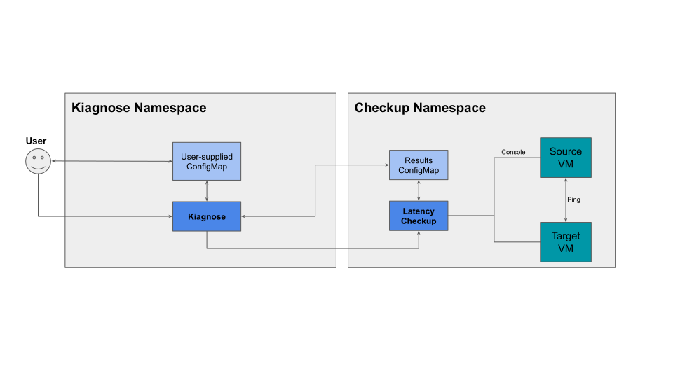

KubeVirt Network Latency Checkup
=

**Authors**: [Edward Haas](https://github.com/eddev), [Orel Misan](https://github.com/orelmisan), [Or Mergi](https://github.com/ormergi)

# Summary

Provide the functionality to validate connectivity and measure latency on a network, between two virtual machines that
run on a [Kubernetes](https://kubernetes.io/) cluster with [KubeVirt](https://kubevirt.io/).

# Motivation

Cluster administrators are often required to check network connectivity and its performance on various networks. Such
checks may occur immediately after the cluster is deployed, as an acceptance test, when new networks are introduced or
just as part of a troubleshooting effort.

Whatever the reason may be, automating a basic connectivity test with a latency measurement can greatly improve the
maintainability of a cluster, reduce the load from the administrator, minimize potential mistakes from such a
multi-step operation and generally save time.

## Goals

- Validate connectivity between two VMI/s, on a predefined network.
- Measure latency between two VMI/s, on a predefined network.
- Share results (and logs) with the cluster administrator.

## Non-Goals

- Define or configure the network under test.

# Proposal

## Definition of Users

- Kubernetes Cluster Administrators

## User Stories

As a Kubernetes Cluster Administrator I would like to:

1. Check the connectivity and latency of a network in my cluster, by:

   1.1. Having an active cluster, with at least two worker nodes.

   1.2. Creating or re-configuring a NetworkAttachmentDefinition, which I am interested in checking.

   1.3. Running the Kubevirt Network Latency checkup, passing the above NetworkAttachmentDefinition as input.

   1.3.1. Optionally, I want to provide the maximum accepted latency, such that beyond this value, the check will fail.

   1.4. Reviewing the status report (of the run), including:

   1.4.1. Success or failure indication.

   1.4.1.1 Setup failure indication is shown in case of a missing/incorrect input.

   1.4.2 Latency details (min, max, average and period).

   1.5. Collecting relevant manifests and logs in case of failure (for troubleshooting).

## API

### Input

> **_Note_**: Kiagnose provides additional environment variables (for example the results ConfigMap).

The checkup shall receive its custom configuration from the following environment variables:

| Env Variable Name                       | Description                                                                                      | Is Mandatory | Remarks                                                              |
|-----------------------------------------|--------------------------------------------------------------------------------------------------|--------------|----------------------------------------------------------------------|
| NETWORK_ATTACHMENT_DEFINITION_NAMESPACE | Namespace where the NetworkAttachmentDefinition object resides.                                  | True         |                                                                      |
| NETWORK_ATTACHMENT_DEFINITION_NAME      | NetworkAttachmentDefinition object name.                                                         | True         |                                                                      |
| SOURCE_NODE                             | Check latency from this node to TARGET_NODE                                                      | False        | When specified the VM will start with a corresponding affinity rule. |
| TARGET_NODE                             | Check latency from SOURCE_NODE to this node                                                      | False        | When specified the VM will start with a corresponding affinity rule. |
| SAMPLE_DURATION_SECONDS                 | Latency check duration [sec]                                                                     | False        | Defaults to 5 [sec]                                                  |
| MAX_DESIRED_LATENCY_MILLISECONDS        | Maximum desired latency between VMs. If the latency is higher than this - the checkup fails [ms] | False        | Defaulting to 0. 0 translates to a no-max-latency limit.             |

Here is how the user-supplied ConfigMap should look like:

```yaml
---
apiVersion: v1
kind: ConfigMap
metadata:
  name: kubevirt-latency-checkup-config
  namespace: kiagnose
data:
  spec.image: kubevirt-vm-latency:<version>
  spec.timeout: <timeout to wait for the checkup to finish [min]>
  spec.clusterRoles: |
     kubevirt-vm-latency-checker
  spec.param.network_attachment_definition_namespace: <string>
  spec.param.network_attachment_definition_name: <string>
  spec.param.source_node: <string>
  spec.param.target_node: <string>
  spec.param.sample_duration_seconds: <string>
  spec.param.max_desired_latency_milliseconds: <string>
...
```

### Output

> **_Note_**: kiagnose requires additional mandatory keys.

The checkup shall report its custom results via a ConfigMap object (received as an input):

| Key                                   | Description                     | Is Mandatory | Remarks |
|---------------------------------------|---------------------------------|--------------|---------|
| status.result.minLatencyNanoSec       | Minimum observed latency [nsec] | True         |         |
| status.result.maxLatencyNanoSec       | Maximum observed latency [nsec] | True         |         |
| status.result.avgLatencyNanoSec       | Average observed latency [nsec] | True         |         |
| status.results.measurementDurationSec | Measurement time [sec]          | True         |         |
| status.result.sourceNode              | Actual source node's name       | True         |         |
| status.result.targetNode              | Actual target node's name       | True         |         |

Here is how the ConfigMap should look like when the latency checkup is finished:

```yaml
---
apiVersion: v1
kind: ConfigMap
metadata:
  name: kubevirt-latency-checkup-config
  namespace: kiagnose
data:
  spec.image: kubevirt-vm-latency:<version>
  spec.timeout: <timeout to wait for the checkup to finish [min]>
  spec.clusterRoles: |
    kubevirt-vm-latency-checker
  spec.param.network_attachment_definition_namespace: <string>
  spec.param.network_attachment_definition_name: <string>
  spec.param.source_node: <string>
  spec.param.target_node: <string>
  spec.param.sample_duration_seconds: <string>
  spec.param.max_desired_latency_milliseconds: <string>
  …
  status.succeeded: <true | false>
  status.failureReason: <empty string | arbitrary string>
  status.result.minLatencyNanoSec: <number as a string>
  status.result.maxLatencyNanoSec: <number as a string>
  status.result.avgLatencyNanoSec: <number as a string>
  status.results.measurementDurationSec: <number as a string>
  status.result.sourceNode: <string>
  status.result.targetNode: <string>
...
```

### Example

#### Input

```yaml
---
apiVersion: v1
kind: ConfigMap
metadata:
  name: kubevirt-latency-checkup-config
  namespace: kiagnose
data:
  spec.image: quay.io/kiagnose/kubevirt-vm-latency:main
  spec.timeout: 5m
  spec.clusterRoles: |
    kubevirt-vm-latency-checker
  spec.param.network_attachment_definition_namespace: default
  spec.param.network_attachment_definition_name: br10
  spec.param.source_node: node01
  spec.param.target_node: node02
  spec.param.sample_duration_seconds: 300
  spec.param.max_desired_latency_milliseconds: 50
---
apiVersion: batch/v1
kind: Job
metadata:
   name: latency-checkup1
   namespace: kiagnose
spec:
   backoffLimit: 0
   template:
      spec:
         serviceAccount: kiagnose
         restartPolicy: Never
         containers:
            - name: framework
              image: quay.io/kiagnose/kiagnose:main
              env:
                 - name: CONFIGMAP_NAMESPACE
                   value: kiagnose
                 - name: CONFIGMAP_NAME
                   value: kubevirt-latency-checkup-config
```

#### Output

```yaml
apiVersion: v1
kind: ConfigMap
metadata:
  name: kubevirt-latency-checkup-config
  namespace: kiagnose
data:
  spec.image: quay.io/kiagnose/kubevirt-vm-latency:main
  spec.timeout: 5m
  spec.clusterRoles: |
     kubevirt-vm-latency-checker
  spec.param.network_attachment_definition_namespace: default
  spec.param.network_attachment_definition_name: br10
  spec.param.source_node: node01
  spec.param.target_node: node02
  spec.param.sample_duration_seconds: 300
  spec.param.max_desired_latency_milliseconds: 50
  status.succeeded: “true”
  status.failureReason: ””
  status.result.minLatencyNanoSec: 2000
  status.result.maxLatencyNanoSec: 3000
  status.result.avgLatencyNanoSec: 2500
  status.results.measurementDurationSec: 300
  status.result.sourceNode: node01
  status.result.targetNode: node02
```

## Component Dependency

The solution assumes the following components are available (and correctly set):

- Kubevirt is deployed and active in the cluster.
- [Multus](https://github.com/k8snetworkplumbingwg/multus-cni) deployed and ready.
- The [Network Attachment Definition](https://docs.google.com/document/d/1Ny03h6IDVy_e_vmElOqR7UdTPAG_RNydhVE1Kx54kFQ/edit#heading=h.hylsbqoj5fxd) is defined and correctly configured, with a working backend network.

# Design Details

## Diagram


## Deliverables

According to Kiagnose [requirements](checkup_api.md#deliverables).

## Main Processes

### Input Validation

The checkup shall verify all required inputs are present and valid.

### Prerequisites Validation

The checkup shall perform the following checks:

1. Check if Kubevirt is installed and ready.
2. Check if Multus exists.
3. Check if the input NetworkAttachmentDefinition exists.
4. The required nodes are available to run the checkup.

### Setup

The checkup shall perform the following:

1. Create two VMIs, each with node affinity according to the checkup input and with a secondary interface connected to the given NetworkAttachmentDefinition.
2. If the given NetworkAttachmentDefinition makes use of SR-IOV CNI plugin - the VMI's secondary interface should use SR-IOV binding, else use bridge binding.

### Checkup Body

The checkup shall perform the following:

1. Connect to one of the guests and check connectivity to the other.
2. Measure the latency between the two guests on the specific network.
3. In case the maximal latency is higher than expected according to the `MAX_DESIRED_LATENCY_MILLISECONDS` parameter,
   report a corresponding error.

### Output Checkup Results

The checkup shall perform the following:

1. Write results to stdout.
2. Post the results on a [ConfigMap](https://kubernetes.io/docs/concepts/configuration/configmap/) Object.

### Teardown

The checkup shall remove all resources created during the setup phase, including:

- VMI/s

### Failure Reasons

The checkup may fail during execution and report different failure reasons:

- [Input Validation](#input-validation):
  In case one of the parameters that were being passed to the check up are missing or invalid.
- [Prerequisite Validation](#prerequisites-validation):
  One of the checkup prerequisites is not satisfied, for example: Kubevirt is not available.
- Failures that occur during the checkup [setup](#setup), [body](#checkup-body), or [teardown](#teardown).

## Latency measurement

The checkup shall use ICMP echo, using the ping utility from the iputils package, which enables performing simple
latency measurements between two ends.

## IP Stack

The checkup shall support single stack IPv4, IPv6 and dual stack clusters.

## Distribution

In order to distribute the network-latency-self-check, it is necessary to prepare the following items:

- Documentation on how to configure and run such a self-check, including examples.
- Template manifest, from which one can update fields to a specific run.
- Container image for running the connectivity and latency checks.

# Implementation Phases

1. Proof of Concept (PoC)
   Support and implement the minimum needed to show the skeleton of the self-check:
    - Input: NetworkAttachmentDefinition name and namespace, node names, duration, ConfigMap name and namespace.
    - Output: Write the results to the given ConfigMap.
    - Check: Use ping for both connectivity and latency measurement.
    - Support `MAX_DESIRED_LATENCY_MILLISECONDS` parameter The checkup should be considered as failure and return error
      if the measured latency is greater than the given arg.

2. Minimal Viable Product (MVP)
   Same as the PoC phase, but with a production code that is backed by tests.

# Appendix - Possible Future Improvements

- Support multiple networks.
- Collect logs to the pre-configured location.
